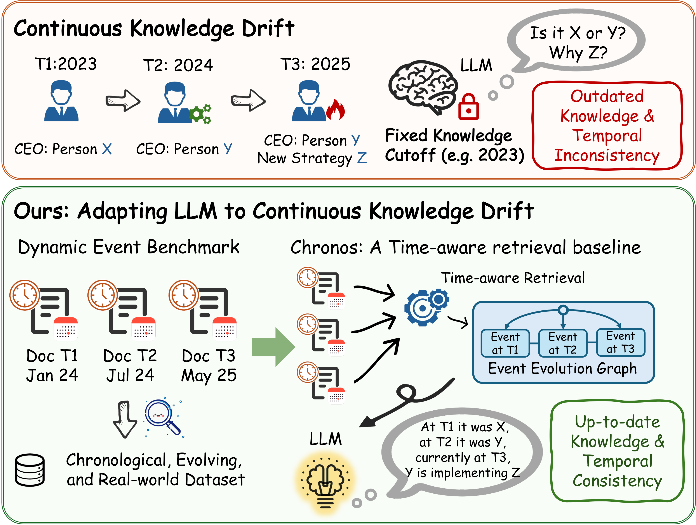

# Chronos

<p align="center">
  
</p>

<p align="center">
  📄 <a href="https://arxiv.org/pdf/2604.05096">Paper</a>
</p>

**Chronos** is a baseline framework for question answering under **continuous knowledge drift**. It provides a unified pipeline for evaluating how large language models (LLMs) adapt to evolving, time-dependent knowledge through structured retrieval, editing, and reasoning.

## Project Structure

```shell
chronos.py          # Main Chronos pipeline
baselines/          # Baseline implementations
├── direct.py       # Direct generation baseline
├── rag.py          # Retrieval-Augmented Generation baseline
├── react.py        # ReAct-style reasoning baseline
├── memit.py        # MEMIT-based model editing baseline
├── rome.py         # ROME-based model editing baseline
└── wise.py         # WISE-based model editing baseline
data/               # Dataset directory (must be prepared before running)
llm_api.py          # Unified LLM / embedding API wrapper (OpenAI / Azure / Claude / DeepInfra)
utils.py            # Utility functions (EM evaluation, time parsing, quad serialization)
```

## Requirements

Python **3.10+** is recommended.

Install dependencies with:

```bash
pip install openai anthropic langchain-core langchain-huggingface sentence-transformers tqdm
```

Before running the code, select the desired `api_source` in `llm_api.py` and place the corresponding API key file in the project root directory.

## Running Experiments

Run Chronos

```bash
python chronos.py
```

Run Baselines

```bash
python baselines/direct.py
python baselines/rag.py
python baselines/react.py
python baselines/memit.py
python baselines/rome.py
python baselines/wise.py
```

## Outputs and Evaluation

All experiment outputs are written to:

```shell
outputs/{method}/{model_id}/{task}/record_*.json
```

Each script automatically reports Exact Match (EM) accuracy for each task upon completion.

## Citation

If you find this work useful, please cite our paper:

```bibtex
@article{liu2026rag,
  title={RAG or Learning? Understanding the Limits of LLM Adaptation under Continuous Knowledge Drift in the Real World},
  author={Liu, Hanbing and Cao, Lang and Li, Yang},
  journal={arXiv preprint arXiv:2604.05096},
  year={2026}
}
```
